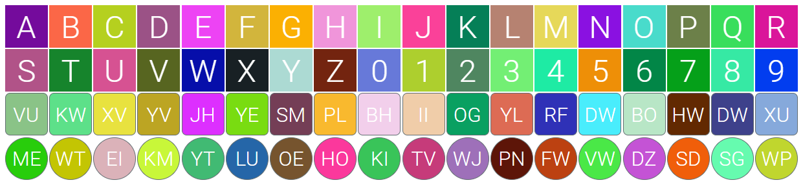

# Custom Avatar Initials

Custom Avatar Initials is simple Web Components Custom Element, that allows to generate fully customizable avatar for web applications. It's appearance can be adapted to the theme used in project. Also it can by used in React, Angular or other framework for web development.



## Setup

### 1. Installation

```bash
npm i custom-avatar-initials
# or
yarn add custom-avatar-initials
```

### 2. Including

Pure html example:

```html
<script src="node_modules/custom-avatar-initials/src/avatar-initials.js"></script>
```

## Attributes

| Attribute          | Description                                                                                                                                     | Default   |
| ------------------ | ----------------------------------------------------------------------------------------------------------------------------------------------- | --------- |
| `initials`         | Letters rendered inside avatar. It has major priority to render when `initials` and `string` are both set.                                      | `ab`      |
| `string`           | Letters rendered inside avatar based on given string like `John Smith`. The rendered result will be `JS`. It has also dash `"-"` sign handling. | -         |
| `size`             | In pixels. Size of the avatar.                                                                                                                  | `60`      |
| `rounded`          | Boolean attribute. `true` value make shape avatar rounded.                                                                                      | `false`   |
| `corner-radius`    | In pixels. Add rounded corners to avatar.                                                                                                       | `0`       |
| `uppercase`        | Boolean attribute. `true` value make avatar text uppercased.                                                                                    | `false`   |
| `text-weight`      | Weight of the avatar text. Set as normal css `font-weight` property like: `100`, `200`, `300`, etc.                                             | `700`     |
| `text-scale`       | Scale of the avatar text.                                                                                                                       | `1`       |
| `text-color`       | Color of the avatar text.                                                                                                                       | `#494949` |
| `text-length`      | Length of the avatar text.                                                                                                                      | `null`    |
| `background-color` | Color of the avatar shape                                                                                                                       | `#e2e2e2` |
| `border`           | In pixels. Border of the avatar shape.                                                                                                          | `0`       |
| `border-color`     | Border color of the avatar shape. When `border` attribute is set, `border-color` gives its default value.                                       | `#494949` |
| `auto-color`       | Boolean attribute. `true` value gives random color to avatar shape.                                                                             | `false`   |

## Usage

Basic usage gives all default properties.

```html
<avatar-initials></avatar-initials>
```

Selected attributes set.

```html
<avatar-initials
  initials="AI"
  text-scale="1.5"
  text-weight="400"
  text-color="#2c3e50"
  rounded
  border="1"
  border-color="#2c3e50"
  background-color="#e67e22"
>
</avatar-initials>
```

## Tests

Tests are written without any external libraries. Just open `avatar-initials.test.html` located in `/tests` directory with your favourite browser and see results!

## Browser support

Web Components works in all majors browsers:

- Chrome
- Firefox
- Opera
- Safari

## License

ISC License
